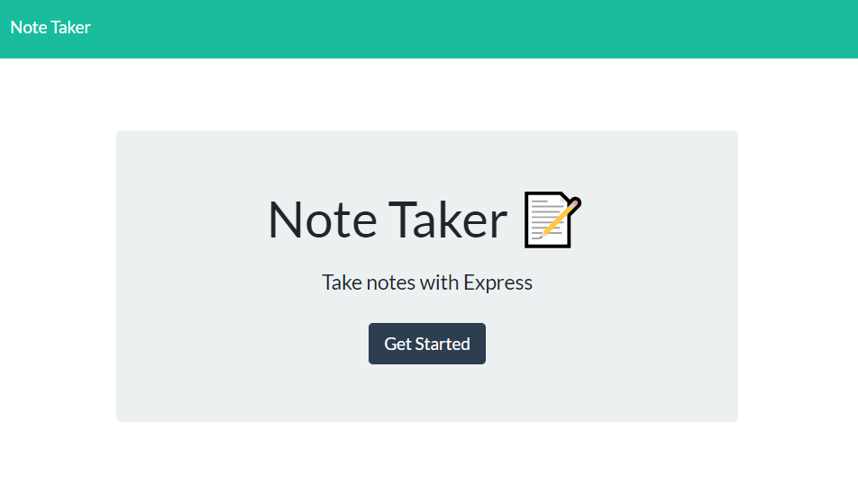
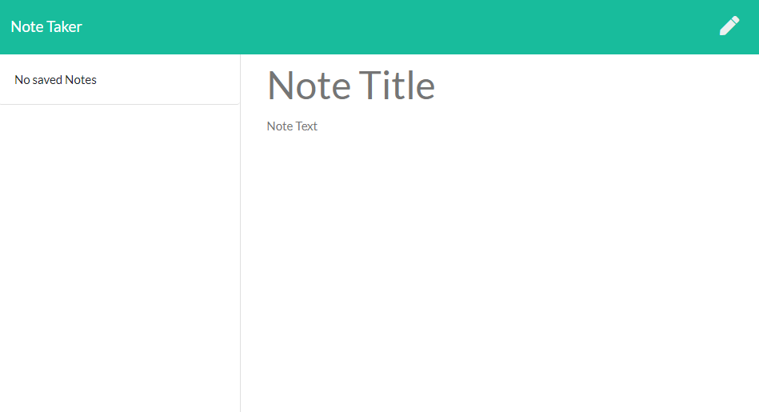
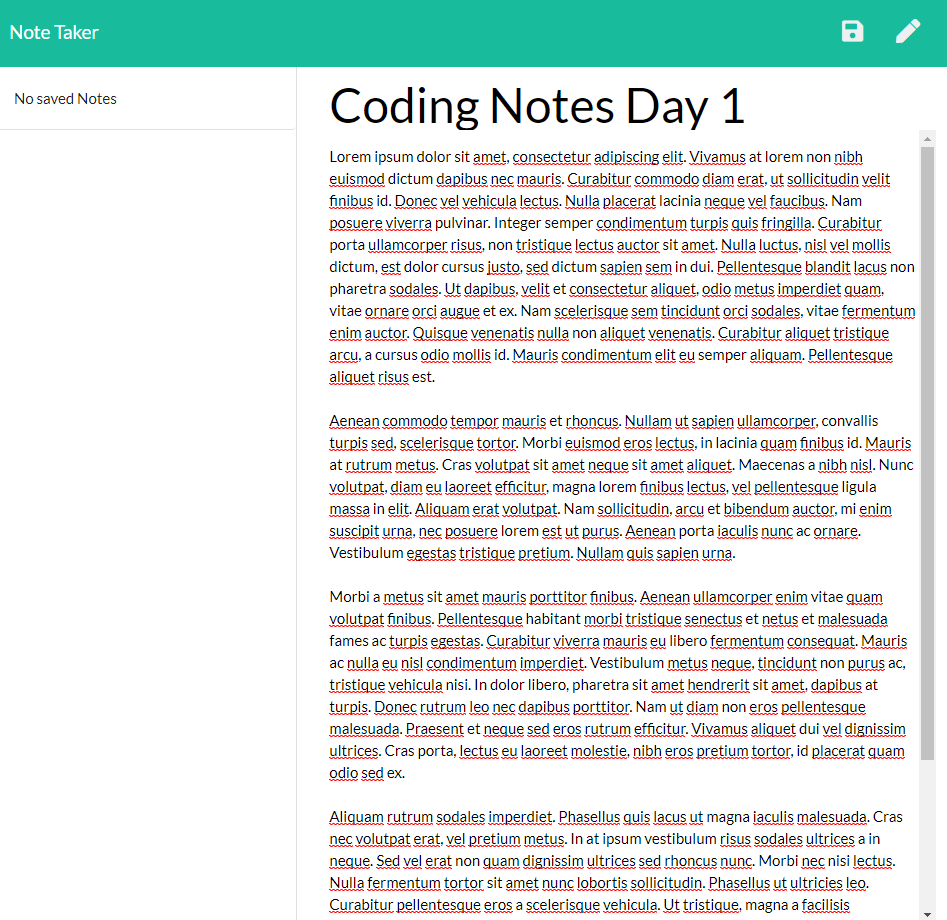
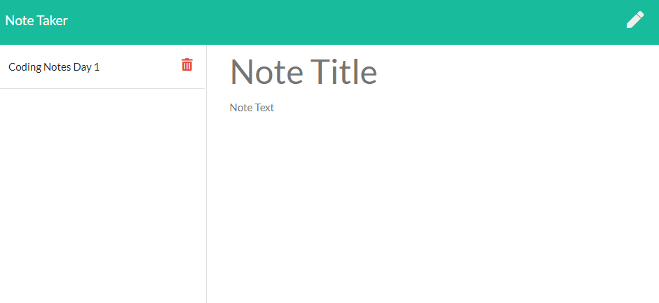
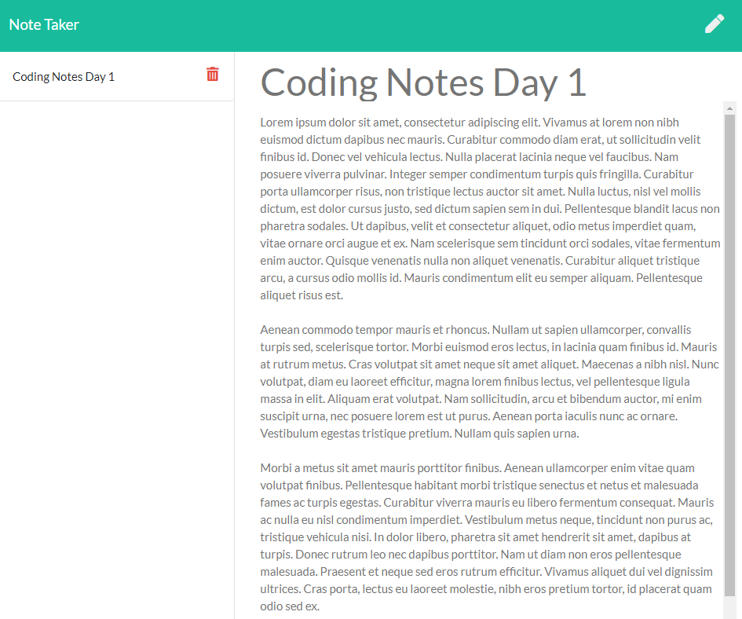

# Note Taker 📔

***
<p align="center">
  
  
  
</p>

[](https://opensource.org/licenses/MIT)




## Table of Contents
* [Description](#description)
* [Installation](#installation)
* [Usage](#usage)
* [Questions](#questions)
* [License](#license)


## Description
Through the use of Express for the backend, this application was created in order to take notes!  A note may be written and saved, and any saved notes may be pulled up or deleted.

Please click [here](https://christina2021-note-taker.herokuapp.com/notes) to try out this Note Taker through Heroku! 


## Installation

If you are downloading/cloning this repo from github, please see the following commands needed in order to use and run this application:<br>
```bash
npm i
node server
```
This application uses the following packages: express and jsonfile.

## Usage
Please see the following instructions on how to use this application: <br>
⭐Click on the Get Started button from the home page to start writing a note!<br>
⭐Once you are redirected the notes page, you may click into the text area that says "Note Title" and "Note Text" in order to write your note. <br>

⭐Once you have written your note, a save button will appear in the top-right corner of the page<br>

⭐When you click on the save button, the text areas will refresh, and your saved note will now be located on the left-side of the page (and it will show the title of the note).<br>

⭐You will be able to click on the saved note in order to see the contents of the note again.<br>

⭐Clicking on the red trash can icon will delete the saved note.<br>

#### Notes on Usage
📝Once you add a note, you will not be able to update it.<br>
📝Once you delete a note, it will be permanently deleted.
<br>

## Questions?
Feel free to check out my github profile [here](https://github.com/test)!
Should you have any questions, you may reach me by e-mail at: <a href="mailto:codechristina2021@gmail.com?subject=Hi,%20Christina!">codechristina2021@gmail.com</a>!.

## License
[MIT](https://choosealicense.com/licenses/mit/#)